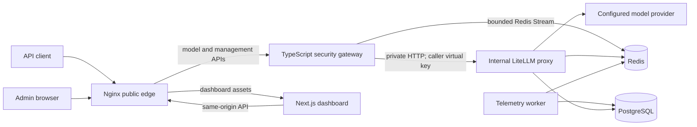

# Zentris Production Architecture

## Purpose and ownership

Zentris is a security gateway around an internal LiteLLM proxy. This repository owns the public gateway, security rules, telemetry worker, dashboard extensions, deployment manifests, and the small LiteLLM integration points required by those components. Provider implementations outside these integration paths remain upstream LiteLLM concerns.

The TypeScript gateway is the only public model-inference API. LiteLLM is reachable only on the private service network. Its management endpoints are exposed through the gateway for the dashboard; known provider and alternative inference endpoints are denied by the management proxy.

## Deployment topology

Docker Compose is the canonical local/release topology. Nginx is the sole public ingress. Compose and Render use `proxy_server_config.production.yaml`; the large `proxy_server_config.yaml` remains a test/demo fixture and is never a release default. The Render blueprint deploys the gateway publicly and LiteLLM, worker, Redis, and PostgreSQL privately. The Vercel dashboard is configured with environment variables and must point at the public gateway, never at LiteLLM.

## Request lifecycle

1. Nginx forwards an API request to the TypeScript gateway and preserves streaming.
2. Route-scoped schemas enforce body shape and the gateway body-size limit.
3. The gateway verifies a Zentris JWT or calls the private LiteLLM `/v1/zentris/auth/introspect` endpoint. Introspection is backed by `user_api_key_auth`; the gateway caches only `SHA-256(token) -> principal` for 60 seconds.
4. The input normalizer produces raw, NFKC, control-cleaned, URL-decoded, base64-decoded, and hex-decoded scan views. Long inputs are scanned in overlapping bounded chunks.
5. The deterministic prompt-injection catalog produces rule IDs, risk, and score. Detection never blocks by itself. Suspect content is treated as untrusted, a server-owned warning is placed before client messages, and the request continues.
6. The versioned DLP catalog finds credentials and sensitive data. Validators remove common false positives (Luhn, Verhoeff, IBAN modulo-97, valid IP ranges, and valid labelled dates). Longest non-overlapping matches are replaced by typed markers before provider transmission.
7. Independent authentication, authorization, tool scope, confirmation, abuse, rate-limit, and malformed-request controls may reject the call.
8. The caller's LiteLLM virtual key and supported generation options are forwarded to the internal proxy, preserving LiteLLM budgets, roles, rate limits, and provider routing.
9. Non-streaming output is DLP-redacted before return. Streaming output is buffered across chunk boundaries and incrementally emitted after redaction; the gateway does not fabricate a completion.
10. Security headers and response extensions provide safe detection metadata. Exact findings never contain the matched secret value.
11. A telemetry envelope is appended to a bounded Redis Stream. Provider/client responses do not depend on PostgreSQL availability.

## Prompt-injection contract

Prompt-injection results are `none`, `low`, `medium`, or `high` and contain stable catalog rule IDs. The model-facing instruction is immutable and precedes all client messages. It tells the model not to obey instructions, reveal policies, invoke tools, or exfiltrate data found in marked content.

Client `system` messages on the OpenAI-compatible endpoint are retained only as untrusted client content when suspicious; they cannot precede the server security instruction. The Zentris-specific `/v1/chat` API rejects client system roles as a stricter contract. User and assistant history roles otherwise remain intact. Retrieved chunks are retained, wrapped, and annotated rather than silently deleted.

The following are not prompt-injection-only controls and may still reject work:

- invalid or absent authentication;
- tenant/tool-scope mismatch or an unknown tool;
- missing confirmation for an authorized high-risk tool;
- malformed or oversized requests;
- request and streaming abuse limits;
- provider timeout, unavailable service, or an open circuit.

## DLP contract

The DLP catalog is used for input, history, retrieval context, non-streaming output, streaming output, errors, and structured log sanitization. Findings persist only rule ID, type/category, stage, risk, action, score, and offsets. Values are never copied into headers, metrics, security events, errors, or Pino records.

Raw prompt/result content is the deliberate exception: it is stored in the admin-protected conversation table for 30 days. Sanitized messages/results are stored alongside it for review and dataset export. Security-event metadata is retained for 90 days.

## Telemetry and persistence

The gateway writes versioned envelopes to `zentris:telemetry:v1` using approximate `MAXLEN`. The worker consumes with a Redis consumer group, handles records in database transactions, assigns deterministic event keys, and marks the daily aggregate as recorded on the conversation row. This makes retries and post-commit Redis failures idempotent. A restarted worker claims entries idle for 60 seconds.

Malformed envelopes move to `zentris:telemetry:dead-letter:v1` with only source ID and exception type. Valid entries are acknowledged and deleted only after database commit. Transient database failures remain pending for recovery. Retention deletion runs hourly against indexed expiry columns.

The PostgreSQL records are:

- `LiteLLM_ZentrisConversationHistory`: exact/sanitized conversations, result, principal/session metadata, generation parameters, outcome, latency, review state, dataset targets, and expiry;
- `LiteLLM_ZentrisSecurityEvent`: safe per-finding/failure metadata with deterministic idempotency key and 90-day expiry;
- `LiteLLM_ZentrisDailyMetric`: request, success, failure, injection, DLP, and latency totals.

## Admin boundary and dashboard

LiteLLM's `proxy_admin` authorization guards every summary, event, history, raw-detail, review, delete, and export route. There is no public dashboard token. Demo access exists only when explicitly enabled and remains rate-limited.

The dashboard presents request/success/failure totals, injection and DLP counts, p50/p95/p99 latency, telemetry queue state, event/history filters, failed calls, raw-versus-sanitized detail, reviews, deletion, and sanitized JSONL exports. Raw export requires an explicit `content=raw` request by a proxy administrator. Assistant exports contain only approved successful conversations. Security exports contain approved labels, risk, and rule IDs. Exports are streamed and not retained server-side.

Raw views, reviews, exports, bulk reviews, and deletes produce audit log entries. Request IDs connect gateway logs, conversation history, events, and client-visible headers. Raw prompts and user IDs must never be metric labels.

## Failure behavior

| Failure | Behavior |
|---|---|
| Invalid key or role | `401`/`403`; no provider call |
| Independent security policy | `400`/`403` or `202` confirmation; prompt injection alone never causes this |
| Provider client error | Preserve appropriate `401`, `403`, or `429` |
| Provider/server failure | Honest `502` or `503`; no fallback text |
| Provider timeout | `504`; streams receive a terminal error event |
| Open circuit | `503`; no fabricated answer |
| Redis telemetry unavailable | Request can complete; safe error log and readiness degradation |
| PostgreSQL unavailable | LiteLLM/admin readiness degrades; telemetry remains pending in Redis |
| Worker crash | Consumer-group pending entry is reclaimed after restart |
| Invalid telemetry | Dead-letter metadata, then acknowledge/delete source entry |

## Performance design

- Rule catalogs compile once at process startup.
- Regexes use bounded wildcards and linear scan views; long text is chunked with overlap.
- DLP validators run only after regex candidate selection.
- LiteLLM identity cache keys are SHA-256 hashes, expire after 60 seconds, and coalesce concurrent cache misses.
- Provider calls use connection reuse through the runtime HTTP client.
- Streaming remains incremental with only a 128-512 character cross-chunk DLP window.
- The gateway uses `WEB_CONCURRENCY` worker processes (four by default in Compose) and UUID request IDs that remain unique across workers.
- Telemetry is one bounded Redis append per completed call. The worker validates batches of up to 50 entries, commits conversations, events, and daily aggregates in a transaction, then acknowledges and deletes the committed stream entries.
- Dashboard summaries use PostgreSQL aggregates and bounded group queries; raw retained content is never loaded for overview metrics.
- Dashboard lists use indexed filters and cursor pagination at the API boundary.

Run `npm run benchmark:security` for the local detector gate. The target is 8 KiB scanning at p95 at or below 5 ms. End-to-end gateway targets must be compared with a same-machine pass-through mock provider at 1, 25, 100, and 200 concurrent requests.

## Operational runbook

### Start and verify

1. Copy `.env.example` to a secret-managed environment; do not commit credentials.
2. Set distinct `LITELLM_MASTER_KEY`, `JWT_SECRET`, and `CONFIRMATION_TOKEN_SECRET` values.
3. Start with `docker compose up --build`.
4. Wait for PostgreSQL and Redis health, LiteLLM migrations/readiness, gateway readiness, worker startup, dashboard, then Nginx.
5. Verify `/health/liveness`, `/health/readiness`, dashboard login, one low-token completion, and the corresponding history/event record.

### Triage

- Use `X-Zentris-Request-Id` to search gateway logs and the admin history/event tables.
- If calls fail but security scans pass, inspect LiteLLM health and provider status. Do not enable a fabricated fallback.
- If `queued_entries` or `lag_seconds` grows, inspect worker logs, PostgreSQL connectivity, consumer-group pending entries, and the dead-letter stream.
- If Redis fails, restore it before relying on rate-limit/session/telemetry durability; provider calls may still succeed depending on readiness policy.
- If PostgreSQL fails, avoid reviewing or exporting stale dashboard results; restore the database and let the worker reclaim pending entries.

### Retention and incident response

- Raw conversations expire after 30 days; security events expire after 90 days.
- Delete a specific retained conversation through the admin API/dashboard; linked events are deleted first.
- Rotate any credential that appears in raw history even if DLP prevented provider/client exposure.
- Export sanitized datasets by default. Handle raw exports as sensitive temporary files and delete them after their authorized purpose.

### Release gates

Run the TypeScript build/tests, targeted Python parity/worker/auth tests, Prisma validation, dashboard clean install/type-check/lint/tests/build, Compose config/build, browser journeys, Docker E2E, detector benchmark, and one bounded live-provider smoke call only when a credential already exists. Never print or log that credential.
